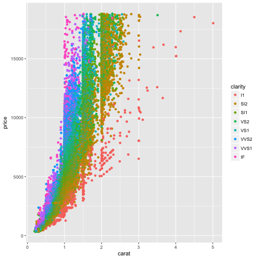

Course Project: Shiny App and Reproducible Pitch
========================================================
author: Taryn Pratt
date: March 17, 2017
autosize: true

Project Details
========================================================

The final project for the Coursera Developing Data Products course is to write a Shiny application and create a presentation pitch with either Slidify or RStudtio Presenter. The Shiny user interface allows users to input various parameters to visualize the data.

The assignment required that the application include:

- a form of input on the UI; an operation on the ui from server.R
- a reactive output displayed as a result of server calculations

My Application
========================================================

This project using the [diamonds dataset](http://docs.ggplot2.org/0.9.3.1/diamonds.html) that is part of the [ggplot2](http://docs.ggplot2.org/current/) library. This dataset consists of various parameters that determine the quality of diamonds including cut, color, and clarity. The table below provides a summary of the dataset.


```r
summary(diamonds)
```

```
     carat               cut        color        clarity     
 Min.   :0.2000   Fair     : 1610   D: 6775   SI1    :13065  
 1st Qu.:0.4000   Good     : 4906   E: 9797   VS2    :12258  
 Median :0.7000   Very Good:12082   F: 9542   SI2    : 9194  
 Mean   :0.7979   Premium  :13791   G:11292   VS1    : 8171  
 3rd Qu.:1.0400   Ideal    :21551   H: 8304   VVS2   : 5066  
 Max.   :5.0100                     I: 5422   VVS1   : 3655  
                                    J: 2808   (Other): 2531  
     depth           table           price             x         
 Min.   :43.00   Min.   :43.00   Min.   :  326   Min.   : 0.000  
 1st Qu.:61.00   1st Qu.:56.00   1st Qu.:  950   1st Qu.: 4.710  
 Median :61.80   Median :57.00   Median : 2401   Median : 5.700  
 Mean   :61.75   Mean   :57.46   Mean   : 3933   Mean   : 5.731  
 3rd Qu.:62.50   3rd Qu.:59.00   3rd Qu.: 5324   3rd Qu.: 6.540  
 Max.   :79.00   Max.   :95.00   Max.   :18823   Max.   :10.740  
                                                                 
       y                z         
 Min.   : 0.000   Min.   : 0.000  
 1st Qu.: 4.720   1st Qu.: 2.910  
 Median : 5.710   Median : 3.530  
 Mean   : 5.735   Mean   : 3.539  
 3rd Qu.: 6.540   3rd Qu.: 4.040  
 Max.   :58.900   Max.   :31.800  
                                  
```

Caret vs. Price
========================================================

By visualizing the data, it becomes clear there is a relationship between the caret and the price of a diamond.  As the carets increase the price tends to increase as well. 



Links
========================================================

The links to the Shiny application, the reproducible presentation, and the code are located below.  By changing parameters of the Shiny application, the plot of the diamond data will change. 

- GitHub Repository - https://github.com/onlybluefeet/ddp
- Shiny Application - https://bluefeet.shinyapps.io/DDPFinalProject/
- Reproducible Presentation - http://rpubs.com/bluefeet/pitch 
